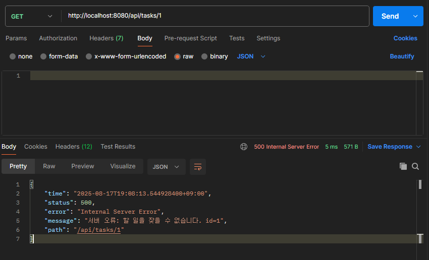
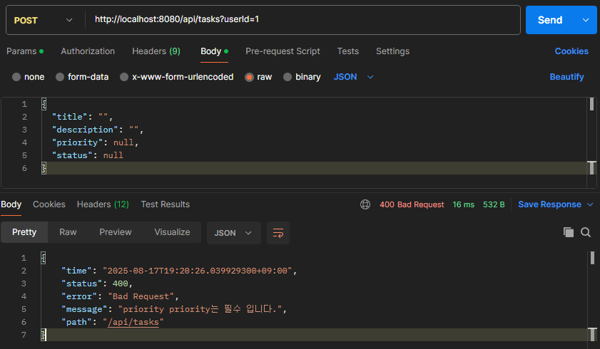

# ✅ Todo API 리팩터링 과정 문서

이 문서는 **AI 적용 Todo 앱**의 API 개발 과정을 기록한 것으로,  
**Before → After** 비교를 통해 개선 과정을 문서화합니다.

---

## 📌 1. 프로젝트 개요
- **프로젝트명**: AI 적용 Todo 앱  
- **목적**: API 개발 과정에서의 문제점과 최종 리팩터링 결과를 비교하여 개선 효과를 문서화  
- **기술 스택**: Spring Boot, JPA, Hibernate, Validation, Postman  

---

## 📌 2. API 엔드포인트 비교

### 🔹 (1) 할 일 생성 API (POST /api/tasks)

#### Before
- 요청: 엔티티(Task) 직접 전달  
- 응답: 엔티티(Task) 직접 반환  
- 문제: 엔티티 필드 직접 노출, 유효성 검증 없음  

.png)
.png)

#### After
- 요청: `TaskCreateRequest` DTO + `@Valid` 검증  
- 응답: `TaskResponse` DTO 반환  
- 개선: 잘못된 입력 차단, 엔티티 노출 제거  

.png)
.png)

---

### 🔹 (2) 단일 조회 API (GET /api/tasks/{id})

.png)
.png)

---

### 🔹 (3) 목록 조회 API (GET /api/tasks?userId=...)

- **Before**: 엔티티 리스트 직접 반환  

.png)
.png)

- **After**: DTO 리스트 반환 (Stream 변환 적용)
- 
.png)
.png)

---

### 🔹 (4) 수정 API (PUT → PATCH)

- **Before**: `PUT` + 엔티티 전체 교체 방식   

.png)
.png)
.png)

- **After**: `PATCH` + `TaskUpdateRequest` DTO 기반 부분 수정 + `204 No Content`
 
.png)
.png)

---

### 🔹 (5) 삭제 API (DELETE /api/tasks/{id})

- **Before**: `200 OK` + 엔티티 반환   

.png)
.png)
.png)

- **After**: `204 No Content` + 전역 예외 처리 적용

.png)
.png)

---

### 🔹 (6) 예외 처리

- **Before**: 컨트롤러별 개별 처리, 일관성 부족  
- **After**: `GlobalExceptionHandler` + `ErrorResponse` JSON 일관화  

  

---

## 📌 3. 개선 효과

- 🔒 **보안 강화**: 엔티티 직접 노출 제거  
- ✅ **데이터 무결성**: DTO + @Valid 적용  
- 🌐 **RESTful**: 상태 코드(201, 204 등) 일관화  
- 🔧 **유지보수성**: 전역 예외 처리로 코드 중복 제거  
